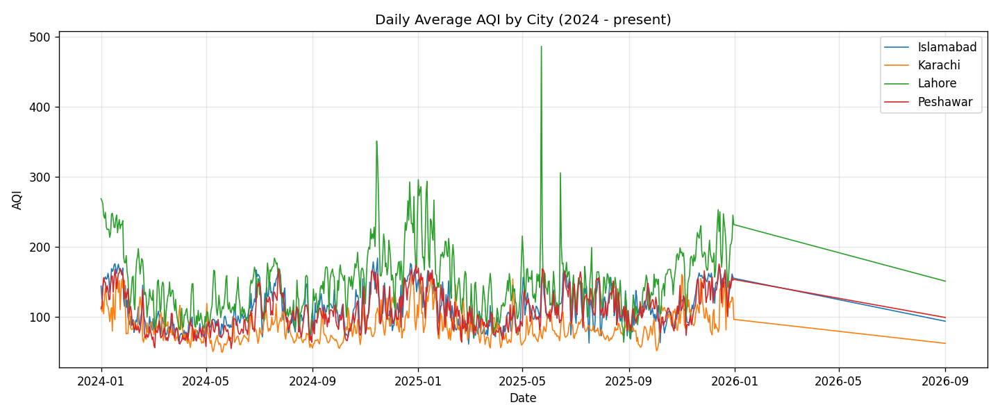
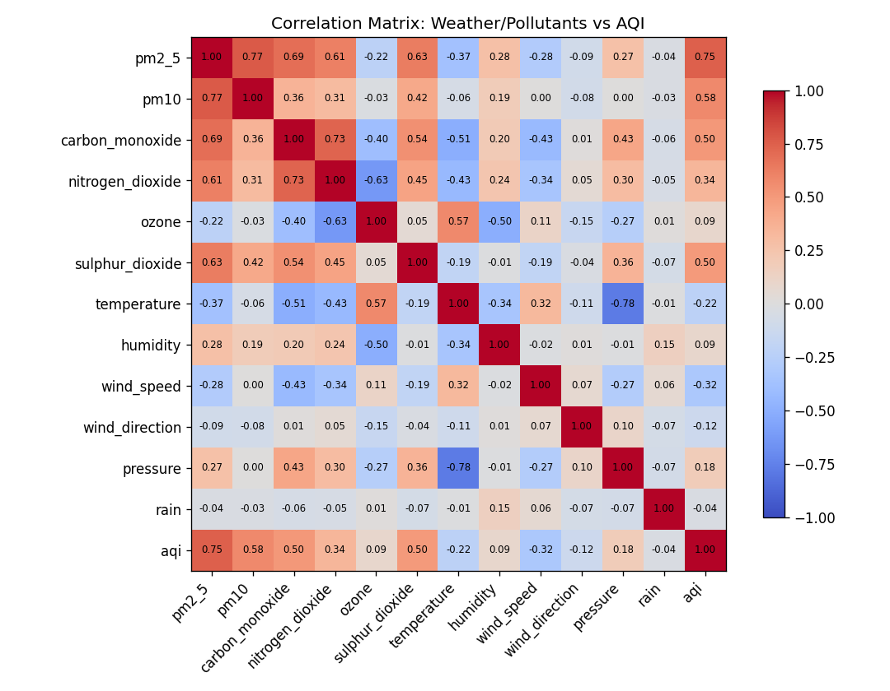
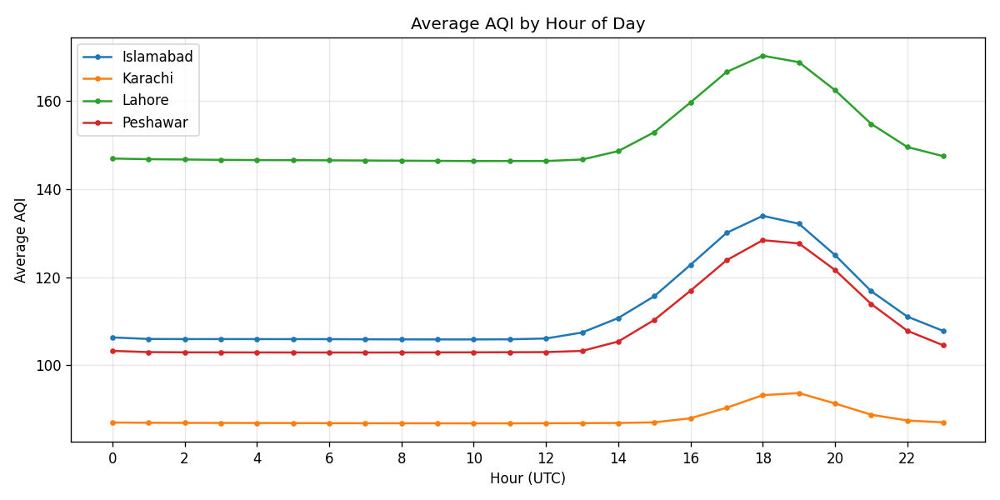
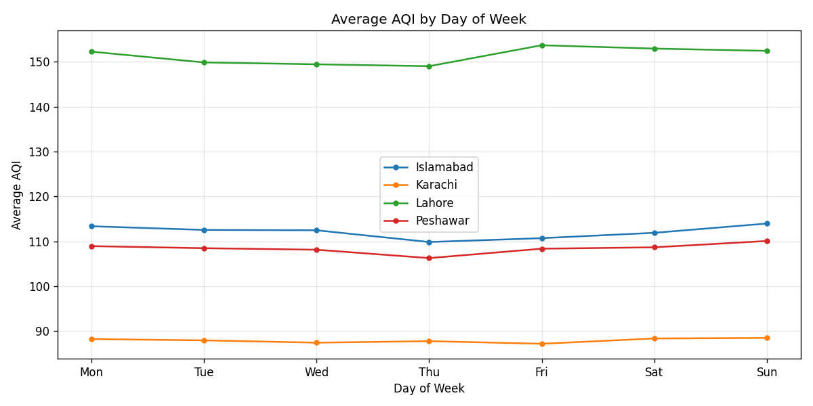
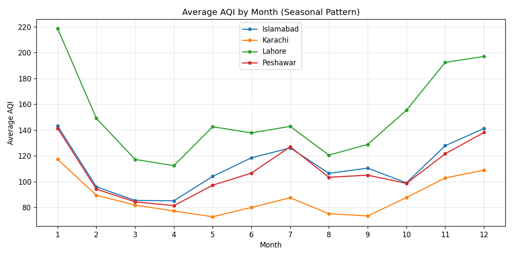

# Exploratory Data Analysis — Pearls AQI Predictor

Data source: Hopsworks Feature Store (`aqi_features_v2` v1), 70180 rows, 2024-01-01 to 2026-09-01, covering Islamabad, Karachi, Lahore, Peshawar.

## 1. AQI Trend Over Time

Per-city AQI summary statistics:

| city      |   mean |   std |   min |    max |
|:----------|-------:|------:|------:|-------:|
| Islamabad | 112.12 | 32.7  | 51.33 | 217.56 |
| Karachi   |  87.93 | 23.2  | 47.18 | 181.28 |
| Lahore    | 151.36 | 49.37 | 56.14 | 537.54 |
| Peshawar  | 108.43 | 31.37 | 38.75 | 210.98 |

## 2. Correlation with AQI

Features most positively correlated with AQI: pm2_5 (r=0.75), pm10 (r=0.58), carbon_monoxide (r=0.50).

Features most negatively correlated with AQI: wind_speed (r=-0.32), temperature (r=-0.22), wind_direction (r=-0.12).

## 3. Hourly Pattern

Averaged across all cities, AQI peaks around hour 18:00 UTC and is lowest around hour 10:00 UTC.

## 4. Day-of-Week Pattern

## 5. Seasonal (Monthly) Pattern

AQI is highest on average in Jan and lowest in Apr, consistent with seasonal pollution patterns (e.g. winter inversion / crop-burning season effects common in Pakistani cities, if applicable to the observed peak month).
